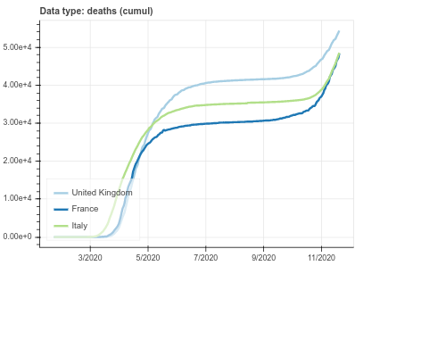
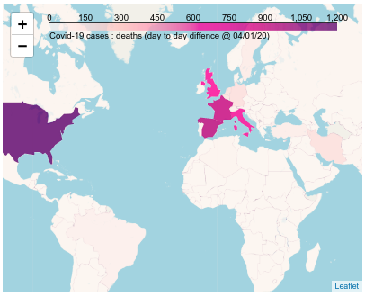
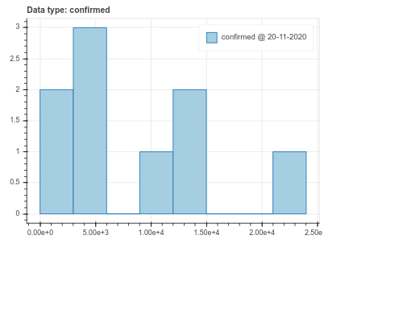
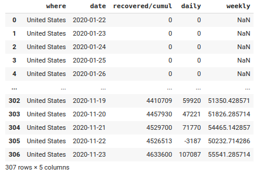

#  PyCoA release v1.0  
April/November 2020

<section id="downloads" class="clearfix">
  <a href="https://github.com/coa-project/pycoa/zipball/main" id="download-zip" class="button" target=_blank><span>Download .zip</span></a>
  <a href="https://github.com/coa-project/pycoa/tarball/main" id="download-tar-gz" class="button" target=_blank><span>Download .tar.gz</span></a>
  <a href="https://github.com/coa-project/pycoa/" id="view-on-github" class="button" target=_blank><span>View on GitHub</span></a>
</section>

[ English  version ](http://pycoa.fr) / 
[  Version française ](http://pycoa.fr/index_FR) 

`PyCoA` (Python Covid Analysis) is a Python™ framework which provides:
- a simple access to common Covid-19 databases;
- tools to represent and analyse Covid-19 data such as time series plots and maps.

  

 

It is designed to be accessible to non-specialists: teenagers learning Python™, students, science journalists, even scientists who are not familiar in data access methods. A simple analysis can be performed out of the box, as well as a more complex analysis for people familiar with Python™ programming. As an example, after installing <a href"https://github.com/coa-project/pycoa/wiki/Install" target=_blank>installing pycoa</a> to your framework, the following few lines of code produce the four figures introducing this short documentation.

```python
import coa.front as cf
cf.plot(where=['France', 'Italy', 'United kingdom'], which='deaths', what='cumul')
cf.map(where=['world'],what='daily',when='01/04/2020')
cf.hist(where='middle africa', which='confirmed',what='cumul')
cf.get(where=['usa'], what='daily', which='recovered',output='pandas')
```

PyCoA works currently inside `Jupyter` notebook, over a local install or on online platforms such as [`Google Colab`](https://colab.research.google.com/).

Demo code is available as a <a href="https://github.com/coa-project/coabook/blob/master/demo_pycoa.ipynb" target=_blank >notebook on GitHub</a> or directly as [`Google Colab notebook`](https://colab.research.google.com/github/coa-project/coabook/blob/master/demo_pycoa.ipynb).

Full documentation is on <a href="https://github.com/coa-project/pycoa/wiki/Home" target=_blank>the Wiki</a>.

### Authors

* Tristan Beau - [Université de Paris](http://u-paris.fr) - [LPNHE laboratory](http://lpnhe.in2p3.fr/)
* Julien Browaeys - [Université de Paris](http://u-paris.fr) - [MSC laboratory](http://www.msc.univ-paris-diderot.fr/)
* Olivier Dadoun - [CNRS](http://cnrs.fr) - [LPNHE laboratory](http://lpnhe.in2p3.fr/)

### Contact
* [`support@pycoa.fr`](mailto:support@pycoa.fr)
* This page : [`pycoa.fr`](http://pycoa.fr)
