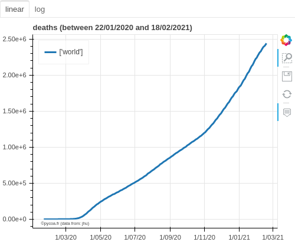
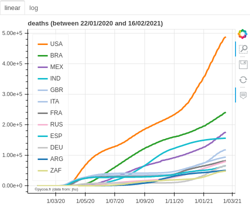
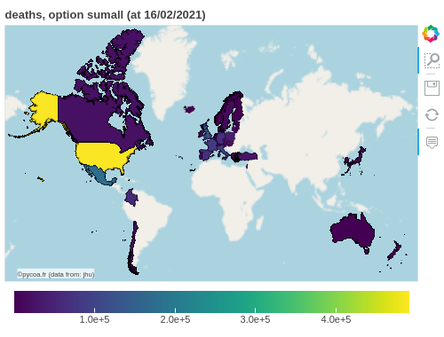
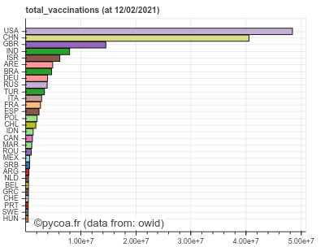
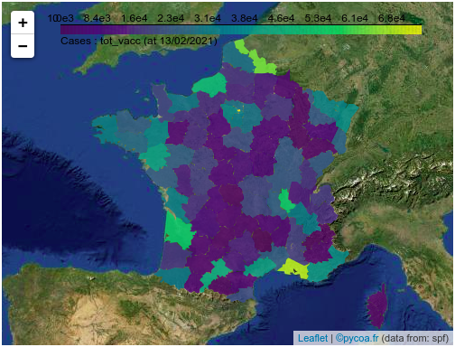
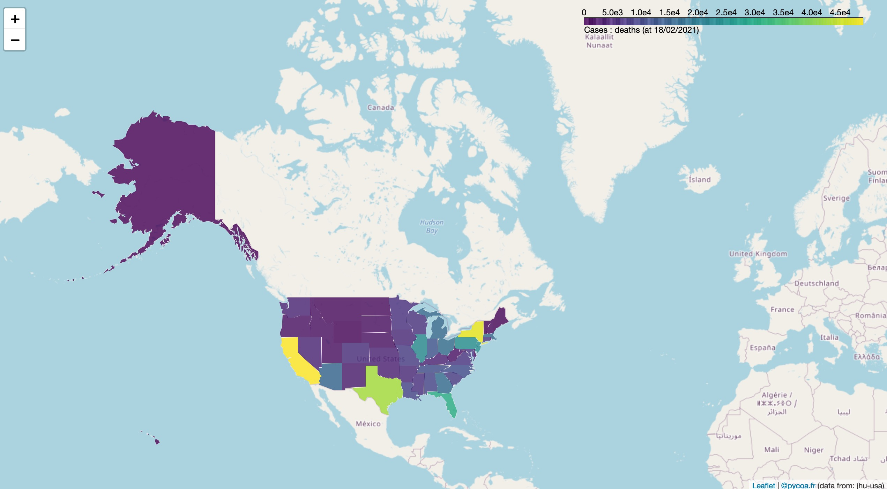

[ English  version ](http://pycoa.fr/index) / 
[  Version française ](http://pycoa.fr/index_FR) 

<section id="downloads" class="clearfix">
  <a href="https://github.com/coa-project/pycoa/archive/main.zip" id="download-zip" class="button" target=_blank><span>Download .zip</span></a>&nbsp;&nbsp;&nbsp;&nbsp;
  <a href="https://github.com/coa-project/pycoa/archive/main.tar.gz" id="download-tar-gz" class="button" target=_blank><span>
    Download .tar.gz</span></a>
  &nbsp;&nbsp;&nbsp;&nbsp;
  <a href="https://github.com/coa-project/pycoa/tree/main" id="view-on-github" class="button" target=_blank><span>View on GitHub</span></a>
  <a href="https://mybinder.org/v2/gh/coa-project/coadocker/HEAD" id="view-on-binder" class="button" target=_blank><span></span></a>
</section>

<center>
<iframe id="mobilehide" height="460" width="580" src="fig/mapFranceVariant.html" frameborder="0"></iframe>
</center>

`PyCoA` (Python Covid Analysis) is a Python™ framework which provides:
- a simple access to common Covid-19 databases;
- tools to represent and analyse Covid-19 data such as time series plots, histograms and maps.

|Time serie (cumulative) | Time series (G20) |
|------------|-------------|
|<a href="fig/pycoa_v2.0_plot_sumall.html" target="_blank"></a>|<a href="fig/pycoa_v2.0_plot_g20.html" target="_blank"></a>|

|MAP (OECD) | Histogram | 
|------------|-------------|
|<a href="fig/pycoa_v2.0_map_oecd.html" target="_blank"></a>|<a href="fig/pycoa_v2.0_hist_bycountry.html" target="_blank"></a>|

It is designed to be accessible to non-specialists: teenagers learning Python™, students, science journalists, even scientists who are not familiar in data access methods. A simple analysis can be performed out of the box, as well as a more complex analysis for people familiar with Python™ programming. As an example, after <a href="https://github.com/coa-project/pycoa/wiki/Install" target=_blank>installing pycoa</a> to your framework, the following few lines of code produce the four figures introducing this short documentation.

```python
import coa.front as cf
# default database is JHU
cf.plot(option='sumall') # default is 'deaths', for all countries
cf.plot(where='g20') # managing region
cf.map(where='oecd',what='daily',when='01/02/2021',which='confirmed')

cf.setwhom('owid') # changing database
cf.hist(which='total_vaccinations') # default is for all countries
```

Since the `v2.0` version, PyCoA manages also local data like
[JHU-USA](https://coronavirus.jhu.edu/) for the United-States, 
[SPF](https://www.santepubliquefrance.fr/dossiers/coronavirus-covid-19) or [OpenCovid19](https://github.com/opencovid19-fr) for France. Then we get plots like the ones just below. Other databases has been added for Italy or India.

|SPF data | JHU-USA data |
|------------|-------------|
|<a href="fig/pycoa_v2.0_spf.html" target="_blank"></a>|<a href="fig/pycoa_v2.0_jhu-usafolium.html" target="_blank"></a>|

```python
cf.setwhom('spf') # Santé Publique France database
cf.map(which='tot_vacc',tile='esri') # Vaccinations, map view optional tile 

cf.setwhom('jhu-usa') # JHU USA database
cf.map(visu='folium') # deaths, map view with folium visualization output
```

`PyCoA` works currently inside `Jupyter` notebook, over a local install or on online platforms such as <a href="https://colab.research.google.com/" target=_blank>Google Colab</a>.

A basic demo code is available as a notebook on <a href="https://github.com/coa-project/coabook/blob/master/demo_pycoa.ipynb" target=_blank > GitHub</a>, on <a href="https://colab.research.google.com/github/coa-project/coabook/blob/master/demo_pycoa.ipynb" target=_blank > Google Colab</a>, or on <a href="https://nbviewer.jupyter.org/github/coa-project/coabook/blob/master/demo_pycoa.ipynb" target=_blank > Jupyter NbViewer</a>. Other notebooks are provided in our <a href="https://github.com/coa-project/coabook/blob/master/README.md" target=_blank >coabook page</a>.

Full documentation is on <a href="https://github.com/coa-project/pycoa/wiki/Home" target=_blank>the Wiki</a>.

### Authors

* Tristan Beau - [Université de Paris](http://u-paris.fr) - [LPNHE laboratory](http://lpnhe.in2p3.fr/)
* Julien Browaeys - [Université de Paris](http://u-paris.fr) - [MSC laboratory](http://www.msc.univ-paris-diderot.fr/)
* Olivier Dadoun - [CNRS](http://cnrs.fr) - [Sorbonne Université](https://www.sorbonne-universite.fr/) - [LPNHE laboratory](http://lpnhe.in2p3.fr/)

### Contact
* Email : [`support@pycoa.fr`](mailto:support@pycoa.fr)
* This page : [`www.pycoa.fr`](http://www.pycoa.fr)

<a href="https://twitter.com/pycoa_fr?ref_src=twsrc%5Etfw" class="twitter-follow-button" data-show-count="false">Follow @pycoa_fr</a><script async src="https://platform.twitter.com/widgets.js" charset="utf-8"></script>

<!--from https://www.buttons.social-->
<script>document.write('<a href="https://www.facebook.com/sharer/sharer.php?u='+encodeURIComponent(document.URL)+'"target="_blank"title="Facebook"style="display:inline-block;vertical-align:middle;width:2em;height:2em;border-radius:10%;box-shadow:0 0 0 .1em #fff inset,.1em .1em 0.1em rgba(0,0,0,.3);background:#3b5998;"><svg style="display:block;fill:#fff;height:44%;margin:28% auto;" viewBox="0 -256 864 1664"><path transform="matrix(1,0,0,-1,-95,1280)" d="M 959,1524 V 1260 H 802 q -86,0 -116,-36 -30,-36 -30,-108 V 927 H 949 L 910,631 H 656 V -128 H 350 V 631 H 95 v 296 h 255 v 218 q 0,186 104,288.5 104,102.5 277,102.5 147,0 228,-12 z" /></svg></a> <a href="https://twitter.com/share?url='+encodeURIComponent(document.URL)+'&text='+encodeURIComponent(document.title)+'"target="_blank"title="Twitter"style="display:inline-block;vertical-align:middle;width:2em;height:2em;border-radius:10%;box-shadow:0 0 0 .1em #fff inset,.1em .1em 0.1em rgba(0,0,0,.3);background:#1b95e0;"><svg style="display:block;fill:#fff;height:36%;margin:32% auto;" viewBox="0 -256 1576 1280"><path transform="matrix(1,0,0,-1,-44,1024)" d="m 1620,1128 q -67,-98 -162,-167 1,-14 1,-42 0,-130 -38,-259.5 Q 1383,530 1305.5,411 1228,292 1121,200.5 1014,109 863,54.5 712,0 540,0 269,0 44,145 q 35,-4 78,-4 225,0 401,138 -105,2 -188,64.5 -83,62.5 -114,159.5 33,-5 61,-5 43,0 85,11 Q 255,532 181.5,620.5 108,709 108,826 v 4 q 68,-38 146,-41 -66,44 -105,115 -39,71 -39,154 0,88 44,163 Q 275,1072 448.5,982.5 622,893 820,883 q -8,38 -8,74 0,134 94.5,228.5 94.5,94.5 228.5,94.5 140,0 236,-102 109,21 205,78 -37,-115 -142,-178 93,10 186,50 z" /></svg></a> <a href="https://www.reddit.com/submit?url='+encodeURIComponent(document.URL)+'&title='+encodeURIComponent(document.title)+'"target="_blank"title="Reddit"style="display:inline-block;vertical-align:middle;width:2em;height:2em;border-radius:10%;box-shadow:0 0 0 .1em #fff inset,.1em .1em 0.1em rgba(0,0,0,.3);background:#ff4500;"><svg style="display:block;fill:#fff;height:46%;margin:26% auto;" viewBox="0 -256 1792 1692"><path transform="matrix(1,0,0,-1,0,1280)" d="m 1792,690 q 0,-58 -29,-105.5 -30,-47.5 -80,-72.5 12,-46 12,-96 0,-155 -106,-287 Q 1482,-3 1298,-79.5 1114,-156 898,-156 682,-156 498.5,-79.5 315,-3 208.5,129 102,261 102,416 q 0,47 11,94 Q 62,535 31,583.5 0,632 0,690 q 0,82 58,140.5 58,58.5 141,58.5 85,0 145,-63 218,152 515,162 l 116,521 q 3,13 15,21 12,8 26,5 l 369,-81 q 18,37 54,60 36,22 79,22 62,0 106,-43 44,-44 44,-106 0,-62 -44,-106 -44,-44 -106,-44 -62,0 -105,44 -44,43 -44,105 l -334,74 -104,-472 q 300,-9 519,-160 58,61 143,61 83,0 141,-58.5 58,-58.5 58,-140.5 z M 418,491 q 0,-62 43.5,-106 43.5,-44 105.5,-44 62,0 106,44 44,44 44,106 0,62 -44,105.5 Q 629,640 567,640 506,640 462,596 418,552 418,491 z m 810,-355 q 11,11 11,26 0,15 -11,26 -10,10 -25,10 -15,0 -26,-10 -41,-42 -121,-62 -80,-20 -160,-20 -80,0 -160,20 -80,20 -121,62 -11,10 -26,10 -15,0 -25,-10 Q 553,178 553,162.5 553,147 564,136 607,93 682.5,68 758,43 805,38.5 852,34 896,34 q 44,0 91,4.5 47,4.5 123,29.5 75,25 118,68 z m -3,205 q 62,0 106,44 43,44 43,106 0,61 -44,105 -44,44 -105,44 -62,0 -106,-43.5 -44,-43.5 -44,-105.5 0,-62 44,-106 44,-44 106,-44 z" /></svg></a> <a href="mailto:?body='+encodeURIComponent(document.URL)+'%0A%0A'+encodeURIComponent(document.querySelector('meta[name=description]')?document.querySelector('meta[name=description]').content:'')+'&subject='+encodeURIComponent(document.title)+'"title="Mail"style="display:inline-block;vertical-align:middle;width:2em;height:2em;border-radius:10%;box-shadow:0 0 0 .1em #fff inset,.1em .1em 0.1em rgba(0,0,0,.3);background:#555;"><svg style="display:block;fill:#fff;height:36%;margin:32% auto;" viewBox="0 -256 1792 1408"><path transform="matrix(1,0,0,-1,0,1024)" d="M 1792,826 V 32 q 0,-66 -47,-113 -47,-47 -113,-47 H 160 Q 94,-128 47,-81 0,-34 0,32 V 826 Q 44,777 101,739 463,493 598,394 655,352 690.5,328.5 726,305 785,280.5 844,256 895,256 h 1 1 q 51,0 110,24.5 59,24.5 94.5,48 35.5,23.5 92.5,65.5 170,123 498,345 57,39 100,87 z m 0,294 q 0,-79 -49,-151 -49,-72 -122,-123 -376,-261 -468,-325 -10,-7 -42.5,-30.5 -32.5,-23.5 -54,-38 Q 1035,438 1004.5,420 974,402 947,393 q -27,-9 -50,-9 h -1 -1 q -23,0 -50,9 -27,9 -57.5,27 -30.5,18 -52,32.5 -21.5,14.5 -54,38 Q 649,514 639,521 548,585 377,703.5 206,822 172,846 110,888 55,961.5 0,1035 0,1098 q 0,78 41.5,130 41.5,52 118.5,52 h 1472 q 65,0 112.5,-47 47.5,-47 47.5,-113 z" /></svg></a> <a href="https://www.linkedin.com/shareArticle?url='+encodeURIComponent(document.URL)+'&title='+encodeURIComponent(document.title)+'"target="_blank"title="LinkedIn"style="display:inline-block;vertical-align:middle;width:2em;height:2em;border-radius:10%;box-shadow:0 0 0 .1em #fff inset,.1em .1em 0.1em rgba(0,0,0,.3);background:#0077b5;"><svg style="display:block;fill:#fff;height:42%;margin:29% auto;" viewBox="0 -256 1536 1468"><path transform="matrix(1,0,0,-1,0,1132)" d="M 349,911 V -80 H 19 v 991 h 330 z m 21,306 q 1,-73 -50.5,-122 Q 268,1046 184,1046 h -2 q -82,0 -132,49 -50,49 -50,122 0,74 51.5,123 51.5,48 134.5,48 83,0 133,-48 50,-49 51,-123 z M 1536,488 V -80 h -329 v 530 q 0,105 -40,164.5 Q 1126,674 1040,674 977,674 934.5,639.5 892,605 871,554 860,524 860,473 V -80 H 531 q 2,399 2,647 0,248 -1,296 l -1,48 H 860 V 767 h -2 q 20,32 41,56 21,24 56.5,52 35.5,28 87.5,43.5 51,15.5 114,15.5 171,0 275,-113.5 Q 1536,707 1536,488 z" /></svg></a> <a href="https://www.buttons.social/share/#'+encodeURIComponent(document.URL)+','+encodeURIComponent(document.title)+','+encodeURIComponent(document.querySelector('meta[name=description]')?document.querySelector('meta[name=description]').content:'')+'"target="_blank"title="More Services"style="display:inline-block;vertical-align:middle;width:2em;height:2em;border-radius:10%;box-shadow:0 0 0 .1em #fff inset,.1em .1em 0.1em rgba(0,0,0,.3);background:#ab2515;"><svg style="display:block;fill:#fff;height:28%;margin:46% auto 0;" viewBox="0 0 10 4"><circle cx="2" cy="2" r="1" /><circle cx="5" cy="2" r="1" /><circle cx="8" cy="2" r="1" /></svg></a>');</script><!--end buttons.social-->
