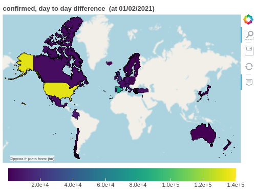

[ English  version ](http://pycoa.fr/index) / 
[  Version française ](http://pycoa.fr/index_FR) 

<section id="downloads" class="clearfix">
  <a href="https://github.com/coa-project/pycoa/archive/main.zip" id="download-zip" class="button" target=_blank><span>Download .zip</span></a>&nbsp;&nbsp;&nbsp;&nbsp;
  <a href="https://github.com/coa-project/pycoa/archive/main.tar.gz" id="download-tar-gz" class="button" target=_blank><span>
    Download .tar.gz</span></a>
  &nbsp;&nbsp;&nbsp;&nbsp;
  <a href="https://github.com/coa-project/pycoa/tree/main" id="view-on-github" class="button" target=_blank><span>View on GitHub</span></a>
  <a href="https://mybinder.org/v2/gh/coa-project/coadocker/HEAD" id="view-on-binder" class="button" target=_blank><span></span></a>
<a href="https://twitter.com/pycoa_fr?ref_src=twsrc%5Etfw" class="twitter-follow-button" data-show-count="false">Follow @pycoa_fr</a><script async src="https://platform.twitter.com/widgets.js" charset="utf-8"></script>
</section>

<center>
<iframe id="mobilehide" height="460" width="580" src="fig/mapFranceVariant.html" frameborder="0"></iframe>
</center>

`PyCoA` (Python Covid Analysis) is a Python™ framework which provides:
- a simple access to common Covid-19 databases;
- tools to represent and analyse Covid-19 data such as time series plots, histograms and maps.

|Time serie (cumulative) | Time series (G20) |
|------------|-------------|
|<a href="fig/pycoa_v2.0_plot_sumall.html" target="_blank"></a>|<a href="fig/pycoa_v2.0_plot_g20.html" target="_blank"></a>|

|MAP (OECD) | Histogram | 
|------------|-------------|
|<a href="fig/pycoa_v2.0_map_oecd.html" target="_blank"></a>|<a href="fig/pycoa_v2.0_hist_bycountry.html" target="_blank"></a>|

It is designed to be accessible to non-specialists: teenagers learning Python™, students, science journalists, even scientists who are not familiar in data access methods. A simple analysis can be performed out of the box, as well as a more complex analysis for people familiar with Python™ programming. As an example, after <a href="https://github.com/coa-project/pycoa/wiki/Install" target=_blank>installing pycoa</a> to your framework, the following few lines of code produce the four figures introducing this short documentation.

```python
import coa.front as cf
# default database is JHU
cf.plot(option='sumall') # default is 'deaths', for all countries
cf.plot(where='g20') # managing region
cf.map(where='oecd',what='daily',when='01/02/2021',which='confirmed')

cf.setwhom('owid') # changing database
cf.hist(which='total_vaccinations') # default is for all countries
```

Since the `v2.0` version, PyCoA manages also local data like
[JHU-USA](https://coronavirus.jhu.edu/) for the United-States, 
[SPF](https://www.santepubliquefrance.fr/dossiers/coronavirus-covid-19) or [OpenCovid19](https://github.com/opencovid19-fr) for France. Then we get plots like the ones just below. Other databases has been added for Italy or India.

|SPF data | JHU-USA data |
|------------|-------------|
|<a href="fig/pycoa_v2.0_spf.html" target="_blank"></a>|<a href="fig/pycoa_v2.0_jhu-usafolium.html" target="_blank"></a>|

```python
cf.setwhom('spf') # Santé Publique France database
cf.map(which='tot_vacc',tile='esri') # Vaccinations, map view optional tile 

cf.setwhom('jhu-usa') # JHU USA database
cf.map(visu='folium') # deaths, map view with folium visualization output
```

`PyCoA` works currently inside `Jupyter` notebook, over a local install or on online platforms such as <a href="https://colab.research.google.com/" target=_blank>Google Colab</a>.

A basic demo code is available as a notebook on <a href="https://github.com/coa-project/coabook/blob/master/demo_pycoa.ipynb" target=_blank > GitHub</a>, on <a href="https://colab.research.google.com/github/coa-project/coabook/blob/master/demo_pycoa.ipynb" target=_blank > Google Colab</a>, or on <a href="https://nbviewer.jupyter.org/github/coa-project/coabook/blob/master/demo_pycoa.ipynb" target=_blank > Jupyter NbViewer</a>. Other notebooks are provided in our <a href="https://github.com/coa-project/coabook/blob/master/README.md" target=_blank >coabook page</a>.

Full documentation is on <a href="https://github.com/coa-project/pycoa/wiki/Home" target=_blank>the Wiki</a>.

### Authors

* Tristan Beau - [Université de Paris](http://u-paris.fr) - [LPNHE laboratory](http://lpnhe.in2p3.fr/)
* Julien Browaeys - [Université de Paris](http://u-paris.fr) - [MSC laboratory](http://www.msc.univ-paris-diderot.fr/)
* Olivier Dadoun - [CNRS](http://cnrs.fr) - [Sorbonne Université](https://www.sorbonne-universite.fr/) - [LPNHE laboratory](http://lpnhe.in2p3.fr/)

### Contact
* Email : [`support@pycoa.fr`](mailto:support@pycoa.fr)
* This page : [`www.pycoa.fr`](http://www.pycoa.fr)
* Tweeter : [`@pycoa_fr`](https://twitter.com/pycoa_fr)

### We talk about us…
* In the news of the [Physics departement of Université de Paris](https://physique.u-paris.fr) (july 2021) : [«Un logiciel pour mieux comprendre la pandémie»](https://physique.u-paris.fr/actualites/un-logiciel-pycoa-pour-mieux-comprendre-la-pandemie)
* In the news of [Université de Paris](http://u-paris.fr) (june 2021) : [«Un logiciel pour mieux comprendre la pandémie»](https://u-paris.fr/un-logiciel-pour-mieux-comprendre-la-pandemie/)
* At the [22ème salon culture et jeux mathématiques](https://salon-math.fr) (may 2021) : 
[`https://salon-math.fr/2021/04/14/pycoa/`](https://salon-math.fr/2021/04/14/pycoa/)
* At the [hackathon covid - lutter ensemble](https://hackathon-covid.fr) (april 2021) : [`https://forum.hackathon-covid.fr/t/3a-pycoa-une-analyse-python-des-donnees-covid-pour-tous/251`](https://forum.hackathon-covid.fr/t/3a-pycoa-une-analyse-python-des-donnees-covid-pour-tous/251)
