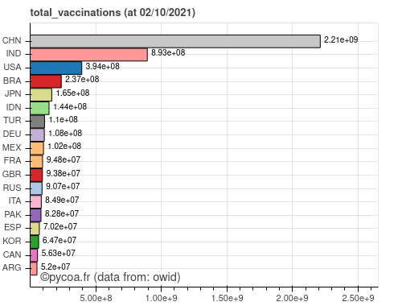
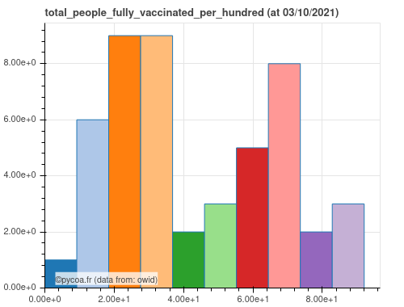

[ English  version ](http://www.pycoa.fr/index) / 
[  Version française ](http://www.pycoa.fr/index_FR) 

<section id="downloads" class="clearfix">
  <a href="https://github.com/coa-project/pycoa/archive/main.zip" id="download-zip" class="button" target=_blank><span>Archive .zip</span></a>
  &nbsp;&nbsp;&nbsp;&nbsp;
  <a href="https://github.com/coa-project/pycoa/archive/main.tar.gz" id="download-tar-gz" class="button" target=_blank><span>
    Archive .tar.gz</span></a>
  &nbsp;&nbsp;&nbsp;&nbsp;
  <a href="https://github.com/coa-project/pycoa/tree/main" id="view-on-github" class="button" target=_blank><span>Voir sur GitHub</span></a>
<a href="https://mybinder.org/v2/gh/coa-project/coadocker/HEAD" id="view-on-binder" class="button" target=_blank><span></span></a>
<a href="https://twitter.com/pycoa_fr?ref_src=twsrc%5Etfw" class="twitter-follow-button" data-show-count="false">Suivre @pycoa_fr</a><script async src="https://platform.twitter.com/widgets.js" charset="utf-8"></script>
</section>

<center>
<iframe id="mobilehide" height="460" width="580" src="fig/pycoa_v2.10_mapFranceVariant.html" frameborder="0"></iframe>
</center>

`PyCoA` (Python Covid Analysis) est un ensemble de code Python™ qui fournit :
- un accès simple aux bases de données sur la Covid-19 ;
- des outils pour représenter et analyser les données du Covid-19, comme des séries temporelles, des histogrammes ou des cartes.

|Série temporelle (cumulative) | Séries temporelles (G20) |
|------------|-------------|
|<a href="fig/pycoa_v2.10_plot_sumall.html" target="_blank"></a>|<a href="fig/pycoa_v2.10_plot_g20.html" target="_blank"></a>|

|Carte (OCDE) | Histogramme (Monde)| 
|------------|-------------|
|<a href="fig/pycoa_v2.10_plot_oecd.html" target="_blank"></a>|<a href="fig/pycoa_v2.10_hist_bycountry.html" target="_blank"></a>|

|PIE (UE) | Histogram par valeur (Asie) |
|------------|-------------|
|<a href="fig/pycoa_v2.10_pie.html" target="_blank"></a>|<a href="fig/pycoa_v2.10_histval.html" target="_blank"></a>|


Cette analyse est pensée pour être accessible à des non-spécialistes : des lycéen·nes qui apprennent Python™, des étudiant·es, des journalistes scientifiques, voire même des chercheurs et chercheuses qui ne sont pas famillier·es avec l'extraction de données. Des analyses simples peuvent être directement effectuées, et des analyses plus poussées peuvent être produites par les personnes habituées à programmer en Python™. Comme exemple, après avoir <a href="https://github.com/coa-project/pycoa/wiki/FR:Install" target=_blank>installé PyCoA</a>, les quelques lignes suivantes permettent de créer les figures en entête de cette courte documentation.

```python
import coa.front as cf
# default database is JHU
cf.plot(option='sumall') # default is 'deaths', for all countries
cf.plot(where='g20') # managing region
cf.map(where='oecd',what='daily',when='01/02/2021',which='confirmed')

cf.setwhom('owid') # changing database
cf.hist(which='total_vaccinations') # default is for all countries
cf.hist(which='cur_icu_patients',typeofhist='pie',where='european union')
cf.hist(which='total_people_fully_vaccinated_per_hundred',typeofhist='byvalue',where='asia')
```
Depuis la version `v2.0`, PyCoA accède également à des données locales :
- [JHU-USA](https://coronavirus.jhu.edu/) ou [CovidTracking](https://covidtracking.com) pour les États-Unis, 
- [SPF](https://www.santepubliquefrance.fr/dossiers/coronavirus-covid-19), [OpenCovid19](https://github.com/opencovid19-fr) ou [Obepine](https://www.reseau-obepine.fr/donnees-ouvertes/) pour la France,
- [DPC](https://github.com/pcm-dpc/COVID-19) pour l'Italie,
- [Covid19India](https://api.covid19india.org) pour l'Inde,
- [RKI](https://github.com/jgehrcke/covid-19-germany-gae) pour l'Allemagne,
- [Escovid19Data](https://github.com/montera34/escovid19data) pour l'Espagne,
- [PHE](https://api.coronavirus.data.gov.uk) pour le Royaume Uni,
- [Sciensano](https://epistat.sciensano.be) pour la Belgique,
- [DGS](https://github.com/dssg-pt/covid19pt-data) pour le Portugal,
- [MOH](https://github.com/MoH-Malaysia) pour la Malaysie.

Nous pouvons allons obtenir des graphes comme ci-après. D'autres bases ont également été ajouté, pour l'Italie ou l'Inde par exemple.

|Données SPF | Données JHU-USA |
|------------|-------------|
|<a href="fig/pycoa_v2.10_spf.html" target="_blank"></a>|<a href="fig/pycoa_v2.10_jhu-usafolium.html" target="_blank"></a>|

```python
cf.setwhom('spf') # Santé Publique France database
cf.map(which='tot_vacc',tile='esri') # Vaccinations, map view optional tile 

cf.setwhom('jhu-usa') # JHU USA database
cf.map(visu='folium') # deaths, map view with folium visualization output
```

PyCoA fonctionne actuellement au sein de _notebooks_ `Jupyter`, que l'installation soit locale ou bien sur des plateformes en ligne comme <a href="https://colab.research.google.com/" target=_blank>Google Colab</a>.

Un code de démonstration simple est accesible comme sous forme d'un notebook sur <a href="https://github.com/coa-project/coabook/blob/master/demo_pycoa.ipynb" target=_blank > GitHub</a>, sur <a href="https://colab.research.google.com/github/coa-project/coabook/blob/master/demo_pycoa.ipynb" target=_blank > Google Colab</a>, ou sur <a href="https://nbviewer.jupyter.org/github/coa-project/coabook/blob/master/demo_pycoa.ipynb" target=_blank > Jupyter NbViewer</a>. D'autres _notebooks_ sont fournis via notre <a href="https://github.com/coa-project/coabook/blob/master/README.md" target=_blank >page coabook</a>.

La documentation complète se trouve sur <a href="https://github.com/coa-project/pycoa/wiki/FR:Home" target=_blank>le Wiki</a>.

### Auteurs

* Tristan Beau - [Université de Paris](http://u-paris.fr) - [laboratoire LPNHE](http://lpnhe.in2p3.fr/)
* Julien Browaeys - [Université de Paris](http://u-paris.fr) - [laboratoire MSC](http://www.msc.univ-paris-diderot.fr/)
* Olivier Dadoun - [CNRS](http://cnrs.fr) - [Sorbonne Université](https://www.sorbonne-universite.fr/) - [laboratoire LPNHE](http://lpnhe.in2p3.fr/)

### Contact
* Courriel : [`support@pycoa.fr`](mailto:support@pycoa.fr)
* Cette page : [`www.pycoa.fr`](http://www.pycoa.fr/index_FR)
* Tweeter : [`@pycoa_fr`](https://twitter.com/pycoa_fr)

### On parle de nous…
* Dans les actualités du [LPNHE - Laboratoire de Physique Nucléaire et Hautes Énergies](https://lpnhe.in2p3.fr/) (juillet 2021) : [Pycoa, un logiciel pour mieux comprendre la pandémie due à la Covid-19 ](https://lpnhe.in2p3.fr/spip.php?article1596)
* Dans les actualités de [Sorbonne Université](https://www.sorbonne-universite.fr) (juillet 2021) : [PyCoa : un logiciel gratuit d’analyse des données de la Covid-19](https://www.sorbonne-universite.fr/actualites/pycoa-un-logiciel-gratuit-danalyse-des-donnees-de-la-covid-19)
* Dans les actualités de [l'UFR de physique de Université de Paris](https://physique.u-paris.fr) (juillet 2021) : [«Un logiciel pour mieux comprendre la pandémie»](https://physique.u-paris.fr/actualites/un-logiciel-pycoa-pour-mieux-comprendre-la-pandemie)
* Dans les actualités de [Université de Paris](http://u-paris.fr) (juin 2021) : [«Un logiciel pour mieux comprendre la pandémie»](https://u-paris.fr/un-logiciel-pour-mieux-comprendre-la-pandemie/)
* au [22ème salon culture et jeux mathématiques](https://salon-math.fr) (mai 2021) : [`https://salon-math.fr/2021/04/14/pycoa/`](https://salon-math.fr/2021/04/14/pycoa/)
* à l'[hackathon covid - lutter ensemble](https://hackathon-covid.fr) (avril 2021) : [`https://forum.hackathon-covid.fr/t/3a-pycoa-une-analyse-python-des-donnees-covid-pour-tous/251`](https://forum.hackathon-covid.fr/t/3a-pycoa-une-analyse-python-des-donnees-covid-pour-tous/251)
* à l'hackathon [Data Against Covid-19](https://ultrahack.org/covid-19datahack) (avril 2020) : [
