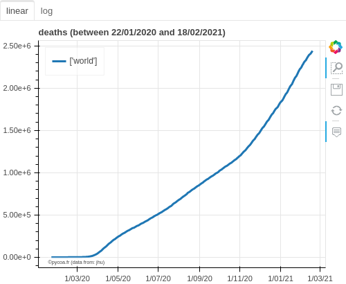
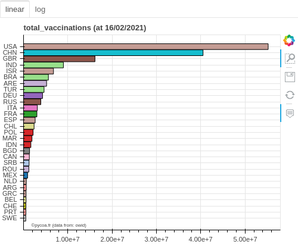

#  PyCoA version v2.0  
Avril 2020 / Février 2021

<section id="downloads" class="clearfix">
  <a href="https://github.com/coa-project/pycoa/archive/v2.0.zip" id="download-zip" class="button" target=_blank><span>Archive .zip</span></a>
  <a href="https://github.com/coa-project/pycoa/archive/v2.0.tar.gz" id="download-tar-gz" class="button" target=_blank><span>Archive .tar.gz</span></a>
  <a href="https://github.com/coa-project/pycoa/tree/v2.0" id="view-on-github" class="button" target=_blank><span>Voir sur GitHub</span></a>
</section>

[ English  version ](http://pycoa.fr) / 
[  Version française ](http://pycoa.fr/index_FR) 

<iframe width="100%" height="200" width="250" src="fig/pycoa_v2_mapworld.html" frameborder="0"></iframe>
`PyCoA` (Python Covid Analysis) est un ensemble de code Python™ qui fournit :
- un accès simple aux bases de données sur la Covid-19 ;
- des outils pour représenter et analyser les données du Covid-19, comme des séries temporelles, es histogrammes ou des cartes.
<p align="center">
|col 1 	     | 	col2	   |
|------------|-------------|
|||
| col1 	     |  col2	   |
|------------|-------------|
|||
</p>
<!---->
<!--  -->

Cette analyse est pensée pour être accessible à des non-spécialistes : des lycéen·nes qui apprennent Python™, des étudiant·es, des journalistes scientifiques, voire même des chercheurs et chercheuses qui ne sont pas famillier·es avec l'extraction de données. Des analyses simples peuvent être directement effectuées, et des analyses plus poussées peuvent être produites par les personnes habituées à programmer en Python™. Comme exemple, après avoir <a href="https://github.com/coa-project/pycoa/wiki/FR:Install" target=_blank>installé PyCoA</a>, les quelques lignes suivantes permettent de créer les figures en entête de cette courte documentation.

```python
import coa.front as cf
# default database is JHU
cf.plot(option='sumall') # default is for all countries
cf.plot(where=['european union','gbr']) # default is 'deaths'
cf.map(where='americas',what='daily',when='01/02/2021',which='confirmed')

cf.setwhom('owid') # changing database
cf.hist(which='total_vaccinations') # default is for all countries
```
Depuis la version `v2.0`, PyCoA accède également à des données locales comme [SPF](https://www.santepubliquefrance.fr/dossiers/coronavirus-covid-19) ou [OpenCovid19](https://github.com/opencovid19-fr) pour la France, [JHU-USA](https://coronavirus.jhu.edu/) pour les États-Unis. Nous pouvons allons obtenir des graphes comme ci-après.

<p align="center">
<iframe src="fig/pycoa_v2_spf.html" 
    sandbox="allow-same-origin allow-scripts"
        width="100%"
        height="500px"
        scrolling="no"
        seamless="seamless"
        frameborder="0">
</iframe>
</p>
```python
cf.setwhom('jhu-usa') # JHU USA database
cf.map() # deaths, map view

cf.setwhom('spf') # Santé Publique France database
cf.map(which='tot_vacc',visu='folium',tile='esri') # Vaccinations, map view with folium visualization output
```

PyCoA fonctionne actuellement au sein de _notebooks_ `Jupyter`, que l'installation soit locale ou bien sur des plateformes en ligne comme <a href="https://colab.research.google.com/" target=_blank>Google Colab</a>.

Un code de démonstration simple est accesible comme sous forme d'un notebook sur <a href="https://github.com/coa-project/coabook/blob/master/demo_pycoa.ipynb" target=_blank > GitHub</a>, sur <a href="https://colab.research.google.com/github/coa-project/coabook/blob/master/demo_pycoa.ipynb" target=_blank > Google Colab</a>, ou sur <a href="https://nbviewer.jupyter.org/github/coa-project/coabook/blob/master/demo_pycoa.ipynb" target=_blank > Jupyter NbViewer</a>. D'autres _notebooks_ sont fournis via notre <a href="https://github.com/coa-project/coabook/blob/master/README.md" target=_blank >page coabook</a>.

La documentation complète se trouve sur <a href="https://github.com/coa-project/pycoa/wiki/FR:Home" target=_blank>le Wiki</a>.

### Auteurs

* Tristan Beau - [Université de Paris](http://u-paris.fr) - [laboratoire LPNHE](http://lpnhe.in2p3.fr/)
* Julien Browaeys - [Université de Paris](http://u-paris.fr) - [laboratoire MSC](http://www.msc.univ-paris-diderot.fr/)
* Olivier Dadoun - [CNRS](http://cnrs.fr) - [Sorbonne Université](https://www.sorbonne-universite.fr/) - [laboratoire LPNHE](http://lpnhe.in2p3.fr/)

### Contact
* [`support@pycoa.fr`](mailto:support@pycoa.fr)
* Cette page : [`pycoa.fr`](http://pycoa.fr)

<a href="https://twitter.com/pycoa_fr?ref_src=twsrc%5Etfw" class="twitter-follow-button" data-show-count="false">Suivre @pycoa_fr</a>
<script async src="https://platform.twitter.com/widgets.js" charset="utf-8"></script>
